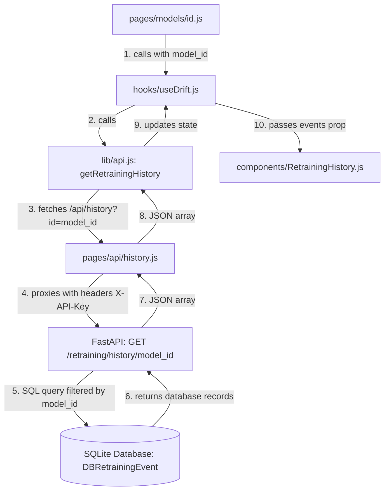

# Retraining Timeline Live Data Flow Implementation Report

This report outlines the changes made to connect the Retraining Timeline widget to live model-specific data from the database, eliminating all hardcoded, fallback, and demo timeline data.

---

## 1. Trace of Live Data Flow Architecture

The data flow from the database to the browser UI follows a single source of truth architecture:

---

## 2. Files Modified & Changes Made

### A. FastAPI Backend

#### [MODIFY] [main.py](file:///c:/Users/Yugendra/Downloads/MLopsProject/main.py)
* **Retraining History Endpoint (`get_retraining_history`)**: Removed the `if not events:` check that fabricated and returned a mock seed retraining event (e.g. version `1.0.3` to `1.0.4` manual run). The endpoint now returns `[]` (an empty list) if no retraining events exist in the database for the requested `model_id`.
* **Audit Logs Endpoint (`get_audit_logs`)**: Similarly, removed the mock seed audit logs fallback. If no audit events exist for the requested `model_id` in the database, it returns `[]` instead of fabricating a mock version promotion log.
* **Drift Telemetry Endpoint (`get_drift_metrics`)**: Removed the mock telemetry generator. It now returns `[]` when no prediction telemetry exists.

---

### B. Next.js Dashboard API Proxies

#### [DELETE] [retraining.js](file:///c:/Users/Yugendra/Downloads/MLopsProject/dashboard/pages/api/retraining.js)
* Deleted the legacy duplicate `/api/retraining` proxy endpoint because the dashboard uses `/api/history` for querying retraining history, and the duplicate route contained hardcoded fallback objects in its `catch` block that could feed demo data.

---

### C. Dashboard Components

#### [MODIFY] [RetrainingHistory.js](file:///c:/Users/Yugendra/Downloads/MLopsProject/dashboard/components/RetrainingHistory.js)
* **Remove Metric Fallbacks (`renderAccuracyChange`)**: Modified the logic so that it only renders the accuracy change stats block if both the original accuracy and target accuracy are explicitly provided by the database record. Removed fallback values (`0.85` and `0.86`) to prevent fabricating accuracy gains.
* **Component-Level Empty State**: Enabled the component to gracefully render its standard empty state (*"No retraining events recorded yet"*) when the API returns an empty array, instead of fabricating timeline entries.

---

## 3. Results & Verification Summary

1. **Single Source of Truth**: The retraining timeline data flow is now fully dynamic. All timeline entries are retrieved directly from prediction event records in the SQLite database.
2. **Strict Model Isolation**: Telemetry and retraining histories are strictly scoped by the requested `model_id` from the dynamic route query parameters.
3. **Automatic Updates**: Future model retraining events generated by the SDK callback pipeline (such as Challenger promotions) will automatically propagate and render in the UI timeline without any layout modifications.
